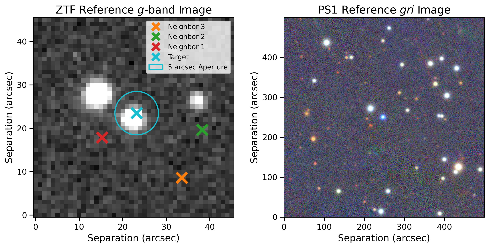

# Welcome to ZTF Check!

**ZTF Check** is Python package that allows you to quickly query the Zwicky Transient Facility (ZTF) and Pan-STARRS (PS1) databases for quick reference images, the latter of which is multicolor. All you need is your target's R.A. and declination!

[](https://pypi.org/project/ZTF-Check/)

### Installation  

To install ZTF Check, execute the following:
```bash
$ pip install ZTF-Check
```

### Usage  

To run ZTF Check on your target, execute the following terminal command (Python 2.X and Python 3.X compatible):   
```bash
$ ztfcheck -ra <ra in degrees> -dec <dec in degrees> -q <whether to show Pan-STARRS query results>
```  

ZTF Check is especially useful when checking to see if you target has an extremely close neighbor or neighboring bright star that could be contaminating it's ZTF light curves. Disclaimer: ZTF Check cannot guarantee if your target's photometry is clean/contaminated. You should inspect the individual images by performing a [Catalog Search](https://irsa.ipac.caltech.edu/Missions/ztf.html) with IRSA to be certain. 




Note that this package makes use of some functions previously developed by [Zach Vanderbosch](https://github.com/zvanderbosch) and [STSCI](http://ps1images.stsci.edu/ps1_dr2_api.html).

This package is a fun side project and largely a work-in-progress (as you can see with the shotty neighbor marking in the example image above!). So, if anything does not work or you have any functionality requests, please correspond with me at jaguidry[at]bu[dot]edu.
